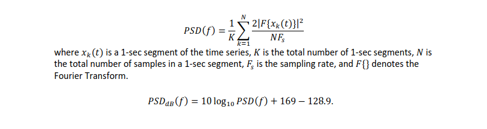
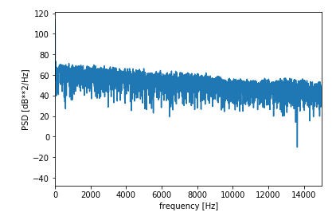
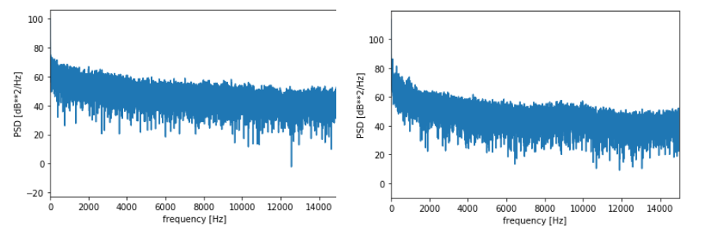
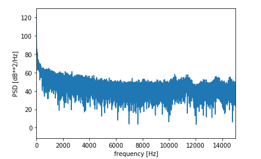
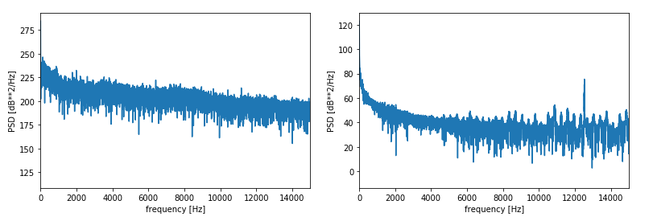
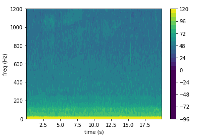
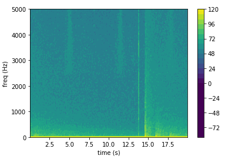
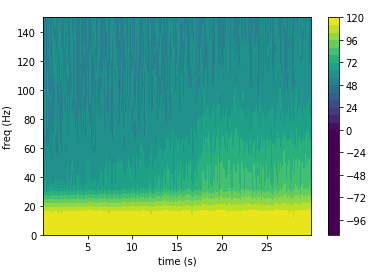
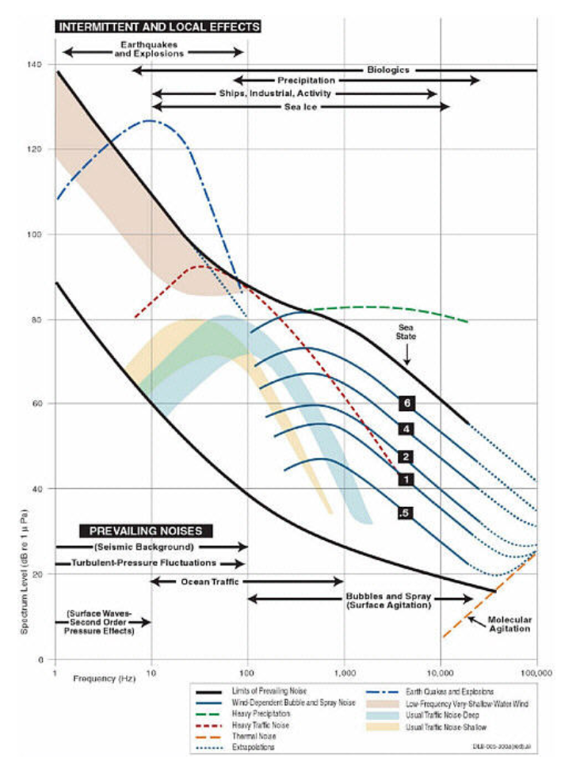

# Hydrophone

Shan Siddiqui 
Dr. Abadi  
B ME 450 
3/14/20 

<b>Code Link: https://github.com/shansiddi/Hydrophone/blob/master/main.ipynb</b> 

Problem Statements 

Part 1 Wind and Rain Noise 

  7.In each site and for each category that you identified in step 3, plot 𝑃𝑆𝐷𝑑𝐵 vs frequency 

  8.Compare the spectral levels and answer these questions: 

  a) What is the effect of wind and rain on underwater noise? Explain any behavior you observe in your result. 

  b) Which one has the highest impact? Rain or wind? 

  c) What are the main reasons for observing different spectral levels in Oregon shelf compared to Oregon offshore? 

Part 2 Airgun, Marine Mammals, Earthquake/Volcano Noise 

  1.Find a short time period that there is a marine mammal vocalization in recorded data and plot its spectrogram. 

  2.Find a short time period that there is an airgun noise in recorded data and plot its spectrogram. 

  3.Find a short time period that there is an earthquake or a volcano eruption in recorded data and plot its spectrogram. 

  4.Compare the bandwidth of these three signals. Are they consistent with what is shown in the Wenz curve? 
  
Solutions Part 1 
7.Power spectral density was found with the formula shown in figure 1 and converted to dB. PSD was plotted against frequency to produce a series of plots like the one shown in figure 2 for wind and rain on the Oregon shelf. All data pulled from OOI hydrophone on Oregon Shelf or Oregon Offshore [1].

<b>figure 1: Power Spectral Density Formula and Conversion to dB</b> 
  

<b>figure 2: Oregon Shelf Wind and Rain </b> 
  
8 a.)Wind generates broadband underwater noise across the frequency spectrum while rain generates a low frequency signal. We can observe this difference from the Oregon shelf wind only or rain only shown in figure 3.  
  

<b>figure 3: Oregon Shelf Wind Only Left Rain Only Right</b>   
  
We find that rain only data has a higher spectral density indicating a more energy dense signal. Suggesting that rain interacts more with the fluid which is discussed further in part b. The superposition of rain and wind brings both the broadband signal of wind and the low frequency rain together as shown in figure 4.

<b>figure 4: Oregon Offshore Wind and Rain</b>   

8 b.)Looking again at figure 3 we also observe rain only to hit the lower frequencies at a spectral density above 80 PSDdb. The wind on the other hand creates a broadband signal below 80 PSDdb. A lower energy density means the signal is less prevelant in the data. This is eulicidated by the nature of rain's interaction with the water versus wind. Rain actually hits the water directly causing ripples which the hydrophone can pick up. But wind usually will not induce these kind of waves. Noise from wind will be spread about the frequency spectrum and consequently spread it's energy density. Rain will have a more concentrated effect on hydrophone data.

8 c.)Generally we expect shelf data to be lower in terms of spectral density as the sea floor and shelf ought to dampen signals relative to offshore signals. Offshore weather patterns are often less forgiving as well because no mountains can dampen them and waves are relentless. However, by pure luck in the data pulled it appears that a lightning strike on the shelf was observed showing that many of these sound effects are localized. Lightning is one of the only possible culprits for a signal of this scale hitting spectral densities of 250 dB [2]. See figure 5 for a comparison of shelf and offshore data.

<b>figure 5: Oregon Shelf Left and Offshore Right</b>   
  
Solutions Part 2

Figures 6, 7, and 8 depict the spectorams for a marine mammal vocalization, airgun, and earthquake respectively. Data was compared to that of the Wenz curve shown in figure 9.

<b>figure 6: Marine Mammal</b>   
  

<b>figure 7: Airgun</b>     
  

<b>figure 8: Earthquake</b>   
  

<b>figure 9: Wenz Curve [3]</b>   
  
The spectograms are consistent with data from the Wenz curve. Biologics have a wide frequency range which includes the 200-1000 signal found in figure 6. Airguns too have a wide frequency range, but are characterized by very short signals as shown in figure 7 right before the 15 second mark [4]. Earthquakes fall below 100 Hz similar to the low frequency signal shown in figure 8.    

References 

[1] NSF Ocean Observatories Initiative Data Portal, http://ooinet.oceanobservatories.org. Downloaded on (3/14/20).

[2] “Underwater Acoustics,” Underwater Acoustics - Navy Ships. [Online]. Available: https://fas.org/man/dod-101/sys/ship/acoustics.htm. [Accessed: 15-Mar-2020].

[3] Ocean noise and marine mammals. Washington, D.C.: National Academic Press, 2003.

[4] L. Hermannsen, J. Tougaard, K. Beedholm, J. Nabe-Nielsen, and P. T. Madsen, “Characteristics and Propagation of Airgun Pulses in Shallow Water with Implications for Effects on Small Marine Mammals,” PloS one, 27-Jul-2015. [Online]. Available: https://www.ncbi.nlm.nih.gov/pmc/articles/PMC4516352/. [Accessed: 14-Mar-2020].
